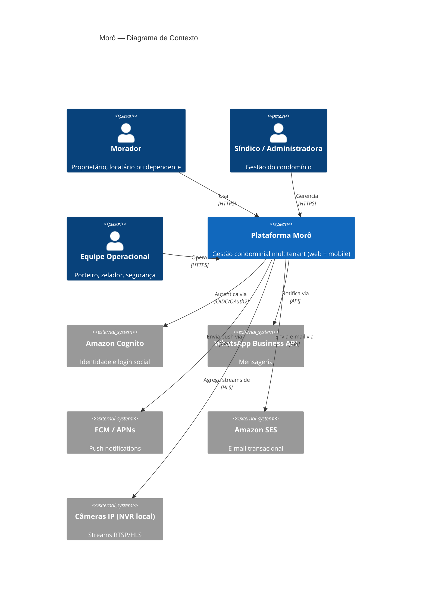
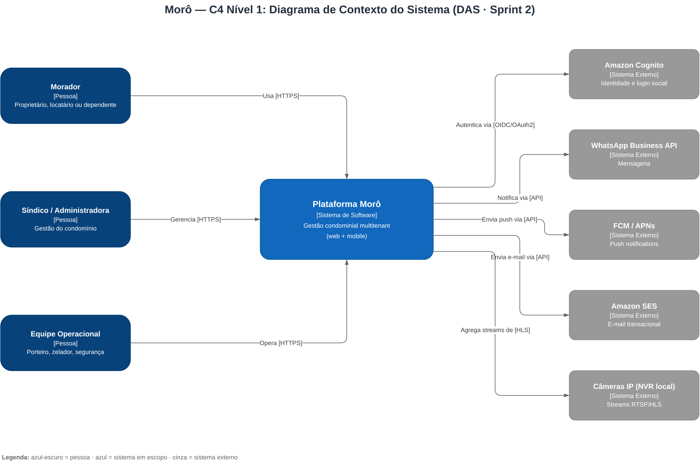
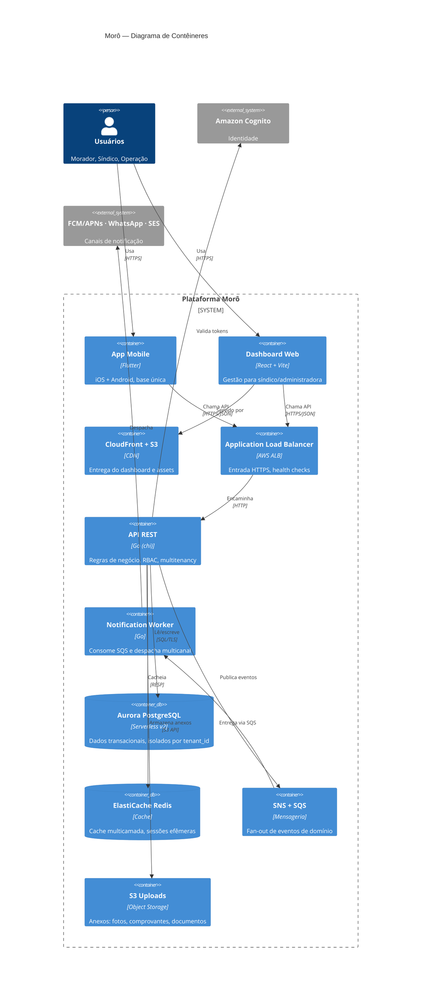
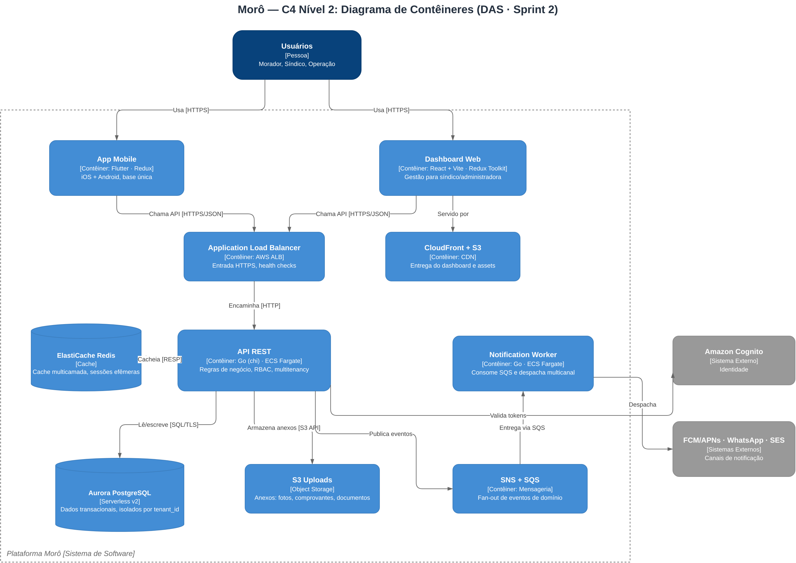
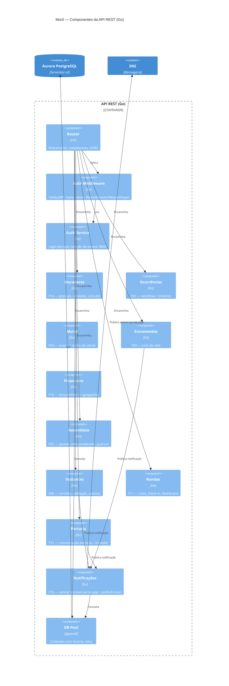
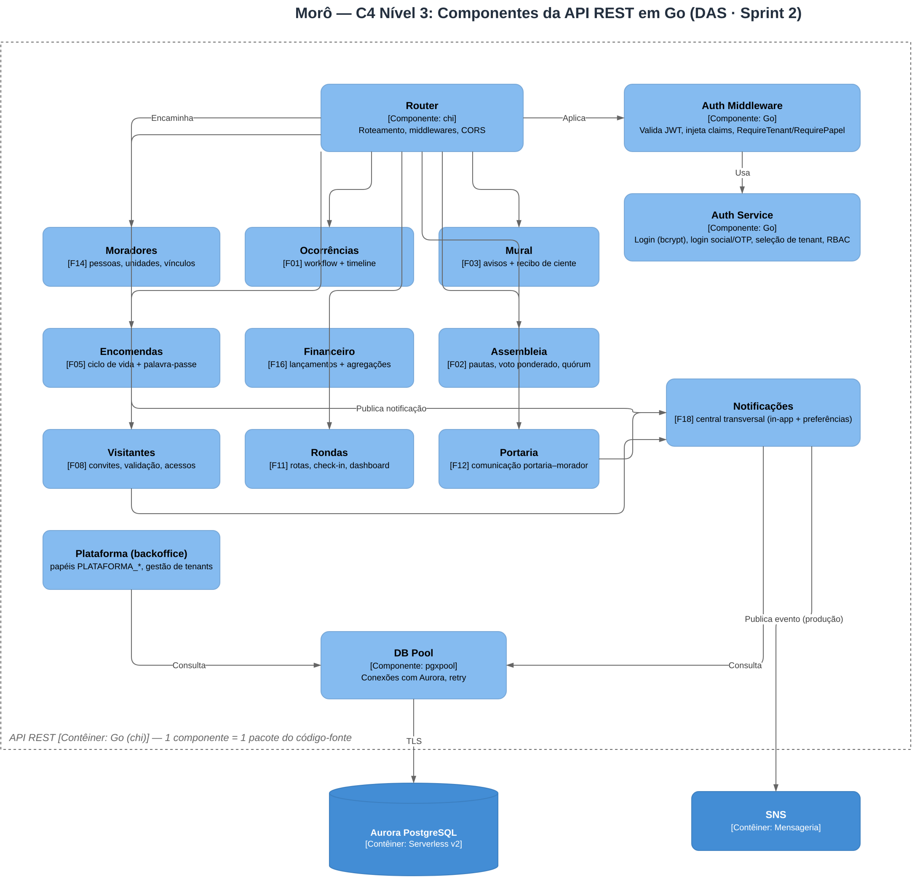
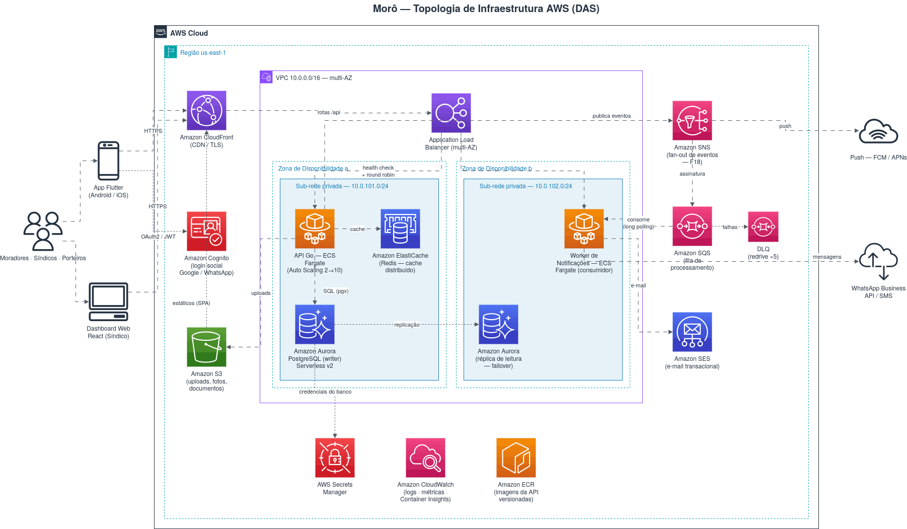

# 03 — Modelo C4

Notação **C4 Model** (Simon Brown): níveis de Contexto, Contêineres e
Componentes. O nível de Código é representado pela própria organização de
pacotes do MVP (`mvp/backend/internal`).

> **Diagramas draw.io:** os três níveis estão versionados em
> [`c4-model.drawio`](c4-model.drawio) (uma página por nível) e exportados em
> PNG: [nível 1](c4-nivel1-contexto.png) · [nível 2](c4-nivel2-conteineres.png)
> · [nível 3](c4-nivel3-componentes.png). Os diagramas Mermaid abaixo são a
> versão renderizável no próprio GitHub.

## 3.1 Nível 1 — Contexto do Sistema

## 3.2 Nível 2 — Contêineres

## 3.3 Nível 3 — Componentes (Contêiner: API REST)

> **Mapa componente → código:** cada componente corresponde a um pacote em
> `mvp/backend/internal/`. O isolamento por pacote concretiza o RNF-M04
> (modularidade / baixo acoplamento).

## 3.4 Vista de implantação — Topologia AWS (draw.io, estilo AWS)

A vista de implantação (deployment) complementa o C4 com a topologia física na
AWS, produzida no **draw.io** com a biblioteca oficial de shapes AWS
(`mxgraph.aws4`) — editável em [`das.drawio`](das.drawio).

Elementos representados: VPC multi-AZ com sub-redes privadas, ALB, ECS Fargate
(API e Notification Worker), Aurora PostgreSQL Serverless v2 (writer + réplica),
ElastiCache Redis, S3 + CloudFront, SNS→SQS com DLQ, Cognito, SES, Secrets
Manager, CloudWatch e ECR — espelhando 1:1 os módulos da [IaC](../iac/terraform/main.tf).

## 3.5 Decisões refletidas no C4

- A separação **API ↔ Notification Worker** materializa o estilo event-driven
  ([ADR-003](adrs.md)): a API não bloqueia para notificar.
- **CloudFront/S3** para o dashboard e **ALB→ECS** para a API seguem o padrão
  cloud-native ([ADR-004](adrs.md)).
- O **Auth Middleware** é o ponto único de aplicação de multitenancy e RBAC,
  evitando dispersão da regra de isolamento ([ADR-005](adrs.md)).
