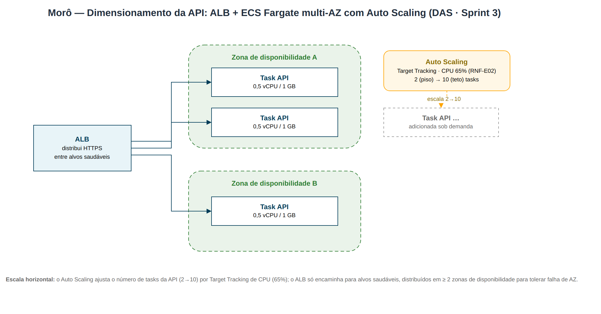

# 08 — Capacity Planning

Dimensionamento e estratégia de escala para atingir os RNF de
[desempenho, escalabilidade e disponibilidade](requisitos.md).

## 8.1 Premissas de carga (cenário-alvo)

| Premissa                                  | Valor de referência          |
| ----------------------------------------- | ---------------------------- |
| Condomínios (tenants)                     | 10.000                       |
| Unidades por condomínio (média)           | 50                           |
| Usuários ativos por condomínio (média)    | 40                           |
| Base de usuários ativos                   | ~400.000                     |
| Pico de usuários simultâneos (3%)         | ~12.000                      |
| Requisições/usuário ativo no pico (min)   | 4                            |
| **RPS de pico estimado**                  | **~800 req/s**               |
| Razão leitura:escrita                     | ~85:15                       |

## 8.2 Dimensionamento da API (ECS Fargate)

- **Perfil da task:** 0,5 vCPU / 1 GB (`api_cpu=512`, `api_memory=1024`).
- **Throughput por task (Go, I/O-bound, p95 ≤ 300 ms):** ~150–200 req/s.
- **Tasks no pico:** `800 / 175 ≈ 5` → margem para **2 (piso) a 10 (teto)** tasks.
- **Gatilho de escala:** Target Tracking **CPU 65%** (RNF-E02).
- **Multi-AZ:** tasks distribuídas em ≥ 2 zonas para tolerância a falha de AZ.

O ALB distribui o tráfego HTTPS entre as tasks saudáveis; o Auto Scaling ajusta
o número de tasks (2→10) por Target Tracking de CPU. Diagrama versionado em
[`capacity-autoscaling.drawio`](capacity-autoscaling.drawio).

## 8.3 Banco de dados (Aurora Serverless v2)

- **Capacidade:** 0,5 ACU (piso) → 4 ACU (teto) — escala conforme carga (RNF-E03).
- **Leituras pesadas (dashboards, balancetes):** roteadas ao **reader endpoint**
  (réplica), preservando a instância de escrita.
- **Cache (RNF-E04):** ElastiCache Redis para dados quentes (KPIs, diretório,
  configurações de tenant), reduzindo *round-trips* ao banco. App mobile usa
  cache local (Hive) — cache **multicamada**.
- **Backup:** retenção contínua de 7 dias → **RPO ≤ 5 min**.

## 8.4 Mensageria (SNS/SQS)

- Picos de eventos (ex.: comunicado em massa F18-RF08) são **absorvidos pela
  fila**; o worker processa no seu ritmo sem pressionar a API.
- **DLQ** isola mensagens problemáticas (RNF-D05); `visibility_timeout=60s`,
  `maxReceiveCount=5`.
- Escala do worker independente da API (event-driven, [ADR-003](adrs.md)).

## 8.5 Metas de SLO e estratégia de verificação

| SLO                         | Meta      | Como medir                                  |
| --------------------------- | --------- | ------------------------------------------- |
| Disponibilidade mensal      | ≥ 99,9%   | CloudWatch (ALB 5xx / target health)        |
| Latência leitura p95        | ≤ 300 ms  | Métricas de aplicação / ALB TargetResponseTime |
| Latência escrita p95        | ≤ 600 ms  | Métricas de aplicação                       |
| Erros 5xx                   | < 0,1%    | CloudWatch Alarms                           |
| Entrega de push             | ≤ 5 s     | Métrica do worker / provedor                |

## 8.6 Gargalos previstos e tratamento

| Gargalo                         | Sintoma                       | Tratamento                                  |
| ------------------------------- | ----------------------------- | ------------------------------------------- |
| Conexões ao banco               | Esgotamento do pool           | `pgxpool` com teto; **RDS Proxy** na evolução |
| Tabelas de eventos/notificações | Crescimento e lentidão        | Particionamento por tempo/tenant; arquivamento |
| NAT Gateway único               | Ponto de custo/banda          | NAT por AZ quando o tráfego de saída justificar |
| Hot tenant (condomínio grande)  | Carga desbalanceada           | Cache agressivo; limites por tenant; read replica |
