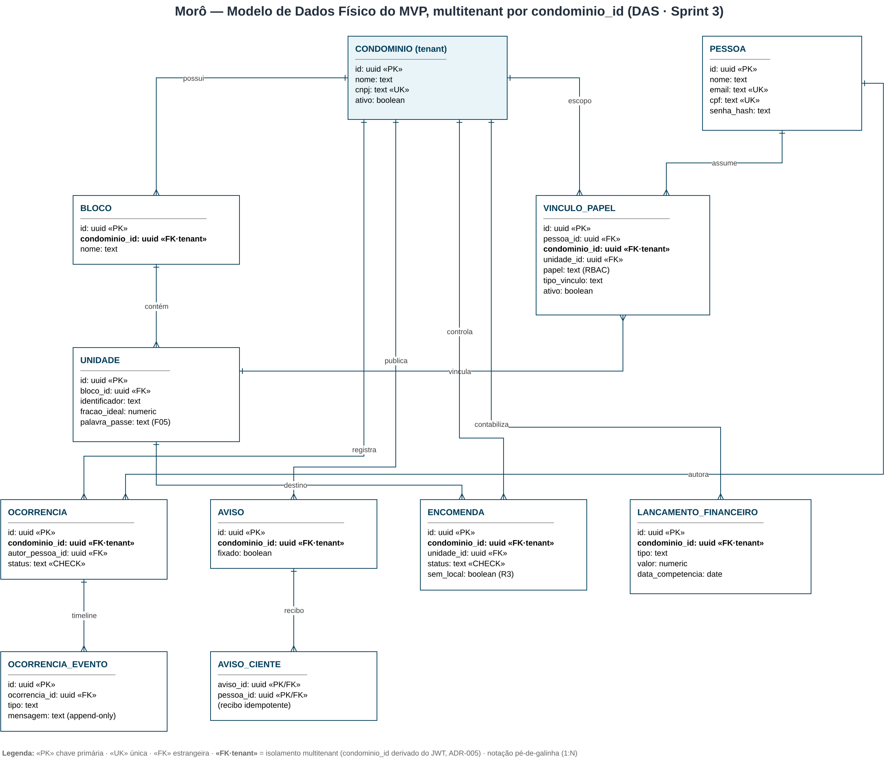

# 04 — Modelo de Dados

> Modelo conceitual completo em `features.md §1`. Este capítulo apresenta o
> **modelo físico do MVP** (implementado em `mvp/backend/internal/migrations/`)
> e as decisões de modelagem que sustentam multitenancy, LGPD e desempenho.
>
> O modelo ER está versionado em [`modelo-dados.drawio`](modelo-dados.drawio),
> no mesmo estilo draw.io dos demais diagramas do DAS.

## 4.1 ER físico (fatia do MVP)

O modelo entidade-relacionamento da fatia implementada no MVP: a identidade
central `PESSOA` (dados pessoais isolados), o tenant `CONDOMINIO` com sua
estrutura física (`BLOCO` → `UNIDADE`), o `VINCULO_PAPEL` que associa
pessoa ↔ condomínio ↔ unidade com papel e vigência, e as tabelas de domínio
(`OCORRENCIA` + `OCORRENCIA_EVENTO`, `AVISO` + `AVISO_CIENTE`, `ENCOMENDA`,
`LANCAMENTO_FINANCEIRO`) — todas escopadas por `condominio_id`.

## 4.2 Decisões de modelagem

### Identidade central (`PESSOA`) — LGPD

Dados pessoais ficam **isolados** em `PESSOA`. Papéis e vínculos são externos
(`VINCULO_PAPEL`). Vantagens:

- **Anonimização/exclusão** (direito ao esquecimento) afeta uma única linha.
- Uma pessoa pode ser **morador em um condomínio e síndico em outro** sem duplicar dados.
- O login é vinculado à pessoa, não ao papel — sustenta o seletor de condomínio (F19-RF10).

### Multitenancy por `condominio_id`

Toda tabela de domínio carrega `condominio_id` (tenant). O isolamento é aplicado
**na camada de aplicação**, com o `tenant_id` derivado **do JWT**, jamais do
corpo da requisição — eliminando IDOR entre tenants. Ver
[ADR-005](adrs.md) e [Threat Model](seguranca-threat-model.md).

### Máquina de estados e timeline append-only

`OCORRENCIA.status` é restrito por `CHECK`; as transições válidas são validadas
no servidor. `OCORRENCIA_EVENTO` é **append-only** — registros nunca são
alterados/excluídos, garantindo trilha de auditoria (timestamp imutável,
F01-RF05).

### Recibo idempotente (`AVISO_CIENTE`)

Chave primária composta `(aviso_id, pessoa_id)` torna o "ciente" naturalmente
idempotente (`ON CONFLICT DO NOTHING`).

## 4.3 Índices e desempenho

| Índice                          | Tabela / colunas                         | Justificativa                          |
| ------------------------------- | ---------------------------------------- | -------------------------------------- |
| `idx_vinculo_pessoa`            | `vinculo_papel(pessoa_id)`               | Login → memberships                    |
| `idx_vinculo_condominio`        | `vinculo_papel(condominio_id)`           | Diretório por tenant                   |
| `idx_ocorrencia_condominio`     | `ocorrencia(condominio_id, status)`      | Listagem filtrada por tenant + status  |
| `idx_evento_ocorrencia`         | `ocorrencia_evento(ocorrencia_id)`       | Carregar timeline                      |
| `idx_encomenda_condominio`      | `encomenda(condominio_id, status)`       | Pendentes por tenant                   |
| `idx_lancamento_condominio`     | `lancamento_financeiro(condominio_id, data_competencia)` | Agregações do dashboard |

## 4.4 Estratégia de evolução

- **Particionamento futuro**: tabelas de alto volume (eventos, notificações)
  podem ser particionadas por `condominio_id` ou por tempo quando a base crescer.
- **Read replicas**: o `reader_endpoint` do Aurora atende relatórios pesados
  (balancetes, dashboards históricos) sem competir com a escrita transacional.
- **Migrações**: no MVP, o schema é aplicado via `docker-entrypoint-initdb.d`;
  em produção, recomenda-se ferramenta de migração versionada (golang-migrate).
