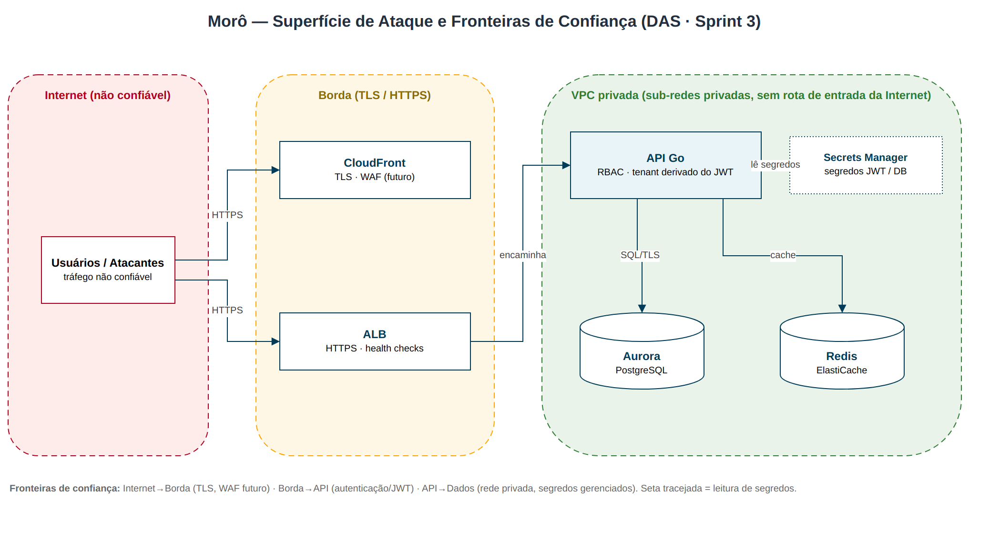

# 07 — Segurança e Threat Model

Análise de ameaças pelo método **STRIDE**, controles aplicados e conformidade
**LGPD**. Complementa os RNF de segurança ([requisitos §2.2](requisitos.md)).

## 7.1 Superfície de ataque e fronteiras de confiança

As fronteiras de confiança separam a **Internet** (não confiável) da **Borda**
(CloudFront/ALB, terminação TLS) e da **VPC privada** (API, Aurora, Redis e
Secrets Manager, sem rota de entrada da Internet). Diagrama versionado em
[`seguranca-fronteiras.drawio`](seguranca-fronteiras.drawio).

Fronteiras: **Internet→Borda** (TLS, WAF futuro), **Borda→API** (autenticação),
**API→Dados** (rede privada, segredos gerenciados).

## 7.2 Análise STRIDE

| Categoria (STRIDE)         | Ameaça                                        | Controle / mitigação                                              |
| -------------------------- | --------------------------------------------- | ---------------------------------------------------------------- |
| **S**poofing               | Roubo de credenciais / sessão                 | bcrypt custo 12; JWT assinado; TLS; MFA opcional (F19-RF08); rate limiting (RNF-S05) |
| **T**ampering              | Alteração de dados em trânsito / payload      | TLS fim a fim; validação de payload; `CHECK`/máquina de estados no servidor |
| **R**epudiation            | Negar ação realizada                          | Timeline append-only (ocorrências); logs CloudWatch; `created_at` imutável |
| **I**nformation Disclosure | Vazamento entre tenants (IDOR)                | `tenant_id` do **JWT**; filtro `condominio_id` em toda query; validação de pertencimento por ID |
| **D**enial of Service      | Exaustão de recursos                          | Auto Scaling; ALB; timeouts; rate limiting; SQS absorve picos    |
| **E**levation of Privilege | Acesso a ação de papel superior               | `RequirePapel` server-side; cliente apenas oculta UI; menor privilégio |

## 7.3 Controle de acesso (RBAC) — defesa em profundidade

1. **Autenticação** (`Tokenizer.Middleware`): exige JWT válido.
2. **Tenant** (`RequireTenant`): exige condomínio ativo no token.
3. **Papel** (`RequirePapel`): restringe a ação ao conjunto de papéis permitidos.
4. **Dado**: queries sempre escopadas por `condominio_id`.

> A autorização **efetiva** é do servidor. O dashboard apenas **oculta** ações
> não permitidas (UX) — nunca é a fonte de verdade da permissão.

## 7.4 Gestão de segredos

- Senha do Aurora e segredo JWT no **AWS Secrets Manager**, injetados na task ECS
  via `secrets`/`valueFrom` — **nunca** em variáveis em texto plano, código ou
  estado de aplicação (RNF-S03).
- IAM com **menor privilégio**: a execução da task só pode ler os ARNs específicos.

## 7.5 Conformidade LGPD

| Princípio LGPD            | Implementação arquitetural                                            |
| ------------------------- | --------------------------------------------------------------------- |
| Minimização               | Dados pessoais isolados em `PESSOA`; demais tabelas referenciam por FK |
| Direito ao esquecimento   | Exclusão/anonimização concentrada em uma entidade                     |
| Consentimento (login social) | Consentimento explícito no onboarding (F19-RNF01)                 |
| Segurança                 | Criptografia em repouso (Aurora/S3) e em trânsito (TLS)               |
| Finalidade / acesso       | RBAC + diretório com visibilidade configurável (F14-RF07)            |

## 7.6 Roadmap de segurança (evolução)

- **AWS WAF** na frente do CloudFront/ALB (OWASP Top 10, bot control).
- **PostgreSQL RLS** como segunda barreira de isolamento de tenant.
- **JWT RS256 + JWKS** e **refresh tokens** com revogação.
- **Rotação automática** de segredos no Secrets Manager.
- **Auditoria centralizada** (CloudTrail + trilha de eventos de domínio).
