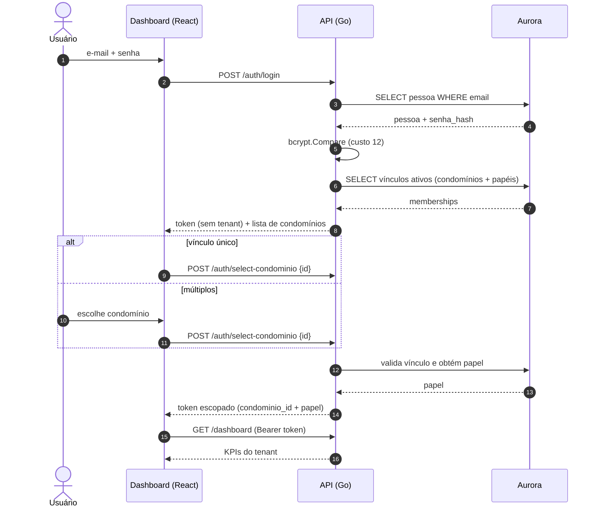
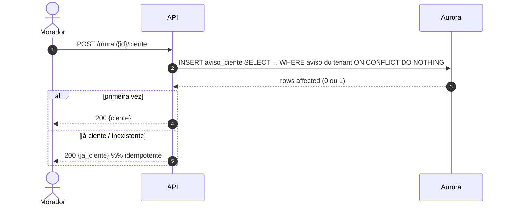
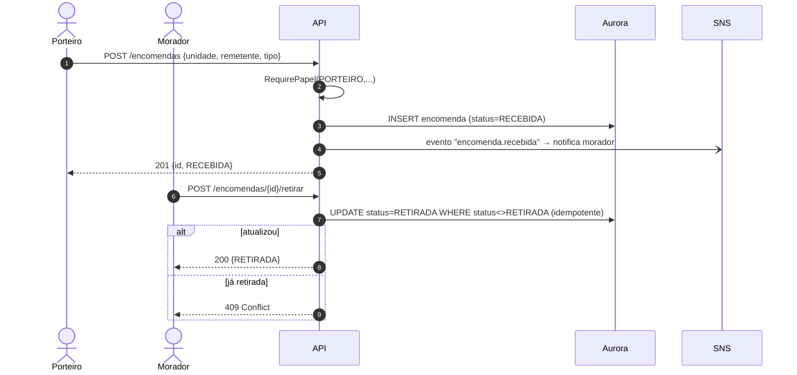

# 06 — Vistas de Sequência

Fluxos dinâmicos das principais features, demonstrando como os componentes do
[Modelo C4](c4-model.md) colaboram em tempo de execução.

## 6.1 Autenticação e seleção de condomínio (F19)



## 6.2 Abertura de ocorrência + notificação assíncrona (F01 → F18)

```mermaid
sequenceDiagram
    autonumber
    actor M as Morador
    participant W as Cliente
    participant A as API
    participant DB as Aurora
    participant SNS as SNS
    participant Q as SQS
    participant K as Notification Worker
    participant C as Canais (push/WhatsApp/e-mail)

    M->>W: descreve ocorrência
    W->>A: POST /ocorrencias (Bearer)
    A->>A: RequireTenant + valida payload
    A->>DB: BEGIN; INSERT ocorrencia (status=ABERTA)
    A->>DB: INSERT ocorrencia_evento (timeline)
    A->>DB: COMMIT
    A-)SNS: publica evento "ocorrencia.aberta" (async)
    A-->>W: 201 Created {id, status}
    SNS->>Q: fan-out
    Q->>K: entrega mensagem
    K->>K: resolve preferências + fallback
    K->>C: despacha notificação
    Note over K,Q: falha → retry; após N → DLQ (RNF-D05)
```

## 6.3 Transição de status com RBAC (F01)

```mermaid
sequenceDiagram
    autonumber
    actor S as Síndico
    participant A as API
    participant DB as Aurora

    S->>A: POST /ocorrencias/{id}/status {EM_ANDAMENTO}
    A->>A: RequirePapel(SINDICO,...) 
    A->>DB: SELECT status atual (WHERE id AND condominio_id)
    DB-->>A: status = EM_ANALISE
    A->>A: valida transição (máquina de estados)
    alt transição válida
        A->>DB: BEGIN; UPDATE status; INSERT evento; COMMIT
        A-->>S: 200 {novo status}
    else inválida
        A-->>S: 409 Conflict (transição inválida)
    end
```

## 6.4 Recibo de leitura no mural (F03)



## 6.5 Ciclo de vida da encomenda (F05)


